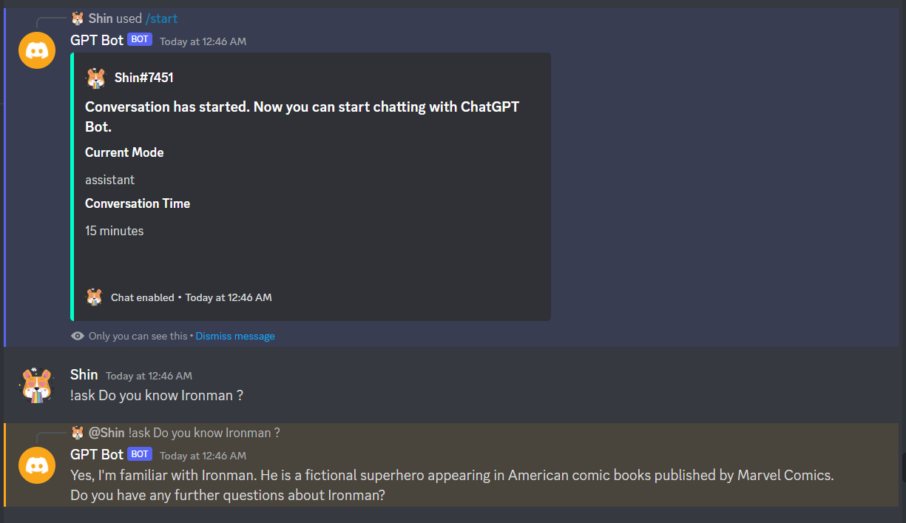
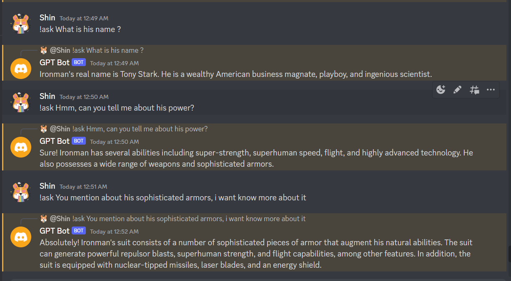
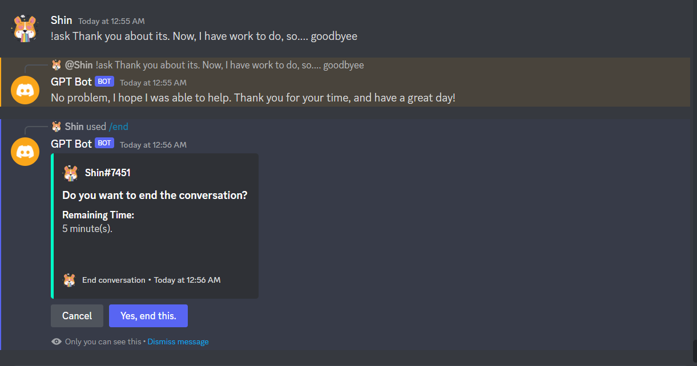

<a name="readme-top"></a>

<h1 align="center">
   <a href="https://github.com/shin202/ChatGPT-Discord-Bot/graphs/contributors">
      
   </a>
   <a href="https://github.com/shin202/ChatGPT-Discord-Bot/network/members">
      
   </a>
   <a href="https://github.com/shin202/ChatGPT-Discord-Bot/stargazers">
      
   </a>
   <a href="https://github.com/shin202/ChatGPT-Discord-Bot/issues">
      
   </a>
   <a href="https://github.com/shin202/ChatGPT-Discord-Bot/blob/main/LICENSE.txt">
      
   </a>
</h1>


<!-- PROJECT LOGO -->
<br />
<div align="center">
  <a href="https://github.com/shin202/ChatGPT-Discord-Bot">
    
  </a>

<h3 align="center">ChatGPT Discord Bot</h3>

  <p align="center">
    An advanced discord chatbot built with NodeJs, Typescript and <a href="https://openai.com/">OpenAI API</a>. 
    <br />
    <a href="https://github.com/shin202/ChatGPT-Discord-Bot"><strong>Explore the docs »</strong></a>
    <br />
    <br />
    <a href="#">View Demo</a>
    ·
    <a href="https://github.com/shin202/ChatGPT-Discord-Bot/issues">Report Bug</a>
    ·
    <a href="https://github.com/shin202/ChatGPT-Discord-Bot/issues">Request Feature</a>
  </p>
</div>


<!-- TABLE OF CONTENTS -->
<details>
  <summary>Table of Contents</summary>
  <ol>
    <li>
      <a href="#about-the-project">About The Project</a>
      <ul>
        <li><a href="#built-with">Built With</a></li>
      </ul>
    </li>
    <li>
      <a href="#getting-started">Getting Started</a>
      <ul>
        <li><a href="#installation">Installation</a></li>
      </ul>
    </li>
    <li><a href="#usage">Features</a></li>
    <li><a href="#bot-commands">Bot Commands</a></li>
    <li><a href="#some-screenshots">Some Screenshots</a></li>
    <li><a href="#contributing">Contributing</a></li>
    <li><a href="#license">License</a></li>
    <li><a href="#contact">Contact</a></li>
    <li><a href="#acknowledgments">Acknowledgments</a></li>
  </ol>
</details>


<!-- ABOUT THE PROJECT -->
## About The Project

ChatGPT re-created with GPT-3.5 as Discord Bot. Using Typescript, NodeJs, DiscordJs and OpenAI API.

<p align="right">(<a href="#readme-top">back to top</a>)</p>


### Built With

* [![NodeJs][Node.js]][Node-url]
* [![Typescript][Typescript]][Typescript-url]

<p align="right">(<a href="#readme-top">back to top</a>)</p>


<!-- GETTING STARTED -->
## Getting Started
I can't afford to deploy its, so you can deploy your own.

### Installation
#### Locally

1. Clone the repo
```sh
    git clone https://github.com/shin202/ChatGPT-Discord-Bot
    cd ChatGPT-Discord-Bot
    npm install
```

1. Get your OpenAI API key at [OpenAI](https://openai.com/api/).
2. Create your discord bot at [Discord Developer](https://discord.com/developers/applications) and get your bot token.
3. Get your bot client id and your discord guild id.
4. Edit `.evn.example` to set your tokens then rename it to `.env`.
5. 🔥 Run and enjoy its 🔥
```sh
    npm start 
```

## Features

- Low latency replies (about 3-5 seconds)
- No request limits
- Supported chat mode: 👩‍💼 LiLy: Assistant, 👨‍💻 Steve: Code Assistant, 👩‍⚕️ Sarah: Psychologist. (*I will add more, if I have time.*)
- Limited conversation time (*To avoid spam*).

<p align="right">(<a href="#readme-top">back to top</a>)</p>


## Bot commands
### Slash commands

- `/start` - Start a new conversation
- `/mode` - Select chat mode
- `/end` - End the conversation
- `/clear` - Clear user messages.

### Prefix Commands

- `!ask` - Use this to chat with ChatGPT.
- `!prefix` - Change prefix.


## Some Screenshots





<!-- CONTRIBUTING -->
## Contributing

Contributions are what make the open source community such an amazing place to learn, inspire, and create. Any contributions you make are **greatly appreciated**.

If you have a suggestion that would make this better, please fork the repo and create a pull request. You can also simply open an issue with the tag "enhancement".
Don't forget to give the project a star! Thanks again! ✨

1. Fork the Project
2. Create your branch (`git checkout -b <your_branch_name> <tag_name>`)
3. Commit your Changes (`git commit -m <your_commit_message>`)
4. Push to the Branch (`git push origin <your_branch_name>`)
5. Open a Pull Request

<p align="right">(<a href="#readme-top">back to top</a>)</p>


<!-- LICENSE -->
## License

Distributed under the MIT License. See `LICENSE.txt` for more information.

<p align="right">(<a href="#readme-top">back to top</a>)</p>


<!-- CONTACT -->
## Contact

Shin - <a href="mailto:shin.dev@proton.me">shin.dev@proton.me</a>

Project Link: [ChatGPT-Discord-Bot](https://github.com/shin202/ChatGPT-Discord-Bot)

<p align="right">(<a href="#readme-top">back to top</a>)</p>


<!-- ACKNOWLEDGMENTS -->
## Acknowledgments

* [How to make your Discord Bot](https://www.youtube.com/@WornOffKeys)
* [Build Chatbot ChatGPT](https://monokaijs.com/blog/sharing/tao-chatbot-gpt)

<p align="right">(<a href="#readme-top">back to top</a>)</p>


<!-- MARKDOWN LINKS & IMAGES -->
[contributors-shield]: https://img.shields.io/github/contributors/github_username/repo_name.svg?style=for-the-badge
[contributors-url]: https://github.com/github_username/repo_name/graphs/contributors
[forks-shield]: https://img.shields.io/github/forks/github_username/repo_name.svg?style=for-the-badge
[forks-url]: https://github.com/github_username/repo_name/network/members
[stars-shield]: https://img.shields.io/github/stars/github_username/repo_name.svg?style=for-the-badge
[stars-url]: https://github.com/github_username/repo_name/stargazers
[issues-shield]: https://img.shields.io/github/issues/github_username/repo_name.svg?style=for-the-badge
[issues-url]: https://github.com/github_username/repo_name/issues
[license-shield]: https://img.shields.io/github/license/github_username/repo_name.svg?style=for-the-badge
[license-url]: https://github.com/github_username/repo_name/blob/master/LICENSE.txt
[linkedin-shield]: https://img.shields.io/badge/-LinkedIn-black.svg?style=for-the-badge&logo=linkedin&colorB=555
[linkedin-url]: https://linkedin.com/in/linkedin_username
[Next.js]: https://img.shields.io/badge/next.js-000000?style=for-the-badge&logo=nextdotjs&logoColor=white
[Next-url]: https://nextjs.org/
[React.js]: https://img.shields.io/badge/React-20232A?style=for-the-badge&logo=react&logoColor=61DAFB
[React-url]: https://reactjs.org/
[Vue.js]: https://img.shields.io/badge/Vue.js-35495E?style=for-the-badge&logo=vuedotjs&logoColor=4FC08D
[Vue-url]: https://vuejs.org/
[Angular.io]: https://img.shields.io/badge/Angular-DD0031?style=for-the-badge&logo=angular&logoColor=white
[Angular-url]: https://angular.io/
[Svelte.dev]: https://img.shields.io/badge/Svelte-4A4A55?style=for-the-badge&logo=svelte&logoColor=FF3E00
[Svelte-url]: https://svelte.dev/
[Laravel.com]: https://img.shields.io/badge/Laravel-FF2D20?style=for-the-badge&logo=laravel&logoColor=white
[Laravel-url]: https://laravel.com
[Bootstrap.com]: https://img.shields.io/badge/Bootstrap-563D7C?style=for-the-badge&logo=bootstrap&logoColor=white
[Bootstrap-url]: https://getbootstrap.com
[JQuery.com]: https://img.shields.io/badge/jQuery-0769AD?style=for-the-badge&logo=jquery&logoColor=white
[JQuery-url]: https://jquery.com
[Typescript]: https://img.shields.io/badge/TypeScript-007ACC?style=for-the-badge&logo=typescript&logoColor=white
[Typescript-url]: https://www.typescriptlang.org
[Node.js]: https://img.shields.io/badge/Node.js-43853D?style=for-the-badge&logo=node.js&logoColor=white
[Node-url]: https://nodejs.org/en
[Express.js]: https://img.shields.io/badge/Express.js-404D59?style=for-the-badge
[Express-url]: https://expressjs.com